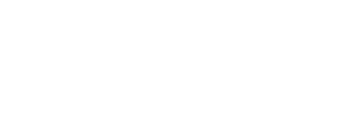

Options trading for fractionalized NFTs using a peer-to-pool AMM Model.

🖌️ UI/UX Design: <https://www.figma.com/file/3LVfwAKZuh5fqvdXdAwuxS/BlueBirdSwap>

🖥️ Backend + Subgraph: <https://github.com/Web3Rizzards/bluebirdswap>

🖥️ Frontend: <https://github.com/Web3Rizzards/new-frontend>

💡 Live Site: <https://new-frontend-frontend.vercel.app/>

## Motivation

Our motivation for creating Bluebird Swap is to provide investors with a new asset class that combines the benefits of non-fungible tokens (NFTs) with the flexibility of options trading. NFTs are unique digital assets that have gained popularity in recent years due to their ability to represent ownership and provenance of digital content. However, the high cost of some NFTs may make them inaccessible to many investors.

Fractionalization of NFTs can help address this issue by allowing investors to purchase a fraction of an NFT. This allows investors to gain exposure to high-value NFTs without having to pay the full price. Fractionalization can also increase liquidity in the NFT market, making it easier for investors to buy and sell NFTs.

Options trading can further enhance the flexibility and potential returns for investors in fractionalized NFTs. Options contracts provide the holder with the right, but not the obligation, to buy or sell an underlying asset at a predetermined price (the strike price) at or before a specific date (the expiration date). This means investors can use options to hedge against price fluctuations or generate additional income from their fractionalized NFT holdings.

In summary, a product for options trading of fractionalized NFTs can provide investors with a new asset class that combines the benefits of NFTs and options trading. This can increase accessibility to high-value NFTs, increase liquidity in the NFT market, and provide investors with more flexibility in managing their investments.

## User Flows

### Pre-login

- User sees Product Logo + Login Button

### Login

- User logs in
- User sees interface
- User sees balance of BLUEBIRD $BB and ETH/MATIC
- Fade into main screen

### Fractionalize NFT

- User logs in to the NFT fractionalization platform.
- User navigates to the "Fractionalize NFT" section of the platform.
- User selects an NFT from a dropdown collection that they own
- User selects the NFT they want to fractionalize
- User clicks the "Fractionalize" button.
- Platform creates a new ERC20 token for the shards and mints the total supply of shards corresponding to the NFT.
- Platform deposits the NFT into a secure smart contract and locks it until the shards are fully redeemed.
- Platform sends the newly created ERC20 tokens to the user's wallet and updates the user's NFT and ERC20 token balances on the platform dashboard.
- User can now trade their fractionalized NFT shards on the platform

### Selecting Collection to trade options

- User logs in to the options trading platform.
- User navigates to the "Trade" section of the platform.
- Platform displays a list of available NFT collections, including the name of the collection, volume of options, and a status bar of puts vs pulls, and the stage of the option (Maker, Taker, Exercise)
- User selects the NFT collection they want to trade options on.

### Trading

- Platform displays a list of available options contracts for the selected NFT collection, including the expiration date, strike price, and **premium**.

- Strike prices available would be (-30%, -20%, -10%, +10%, +20%, +30%) from at the money when the option starts retrieved from chainlink.
- Platform shows the historical floor price of the collection from chainlink.
- User selects the options contract they want to trade and clicks the "Buy" button.
- Platform prompts the user to input the number of options contracts they want to purchase and shows the premium of buying those contracts
- User inputs the quantity of contracts to buy
- User places an order and signs a metamask transaction.

### Post Swap (Claiming)

- If user wins, they should be able to see the tweets that they won
- On the tweet, there should be a claim button for the user to collect their prize
- User clicks on the claim button
- User signs metamask
- User sees updated balance

### Analytics

- User should be able to see the total amount bet
- User should see P/L
- User should be able to see the amount long / short on a particular tweet

### Premium Calculation

An option premium is the price of an option contract. It is thus the income received by the seller (writer) of an option contract.

Options are priced based on the Black-Scholes formula:

$$C(S_t, t) = S_tN(d_1) - Ke^{-r(T-t)}N(d_2)$$

where:

- $C(S_t, t)$ is the price of a call option at time $t$ with strike price $K$ and expiry $T$ on an underlying asset with current price $S_t$.

- $r$ is the risk-free interest rate
- $N$ is the cumulative distribution function of the standard normal distribution
$d_1 = \frac{\ln(S_t/K) + (r + \frac{\sigma^2}{2})(T-t)}{\sigma \sqrt{T-t}}$
$d_2 = d_1 - \sigma \sqrt{T-t}$

Here, $\sigma$ is the volatility of the underlying asset.

## TODOs

- [x] Setup new GitHub organization
- [x] Create Monorepo
 - frontend
 - subgraph
 - blockchain
- [x] Create new private key for hackathon.
- [x] Fund Account with testnet ETH/Matic
- [x] Create Infura account and get API Key
- [x] Create Figma

## BudilBox Submission

Link To Work (Github repo, Google Drive Dropbox etc):

https://github.com/Web3Rizzards/bluebirdswap

Demo URL

// TODO

Video URL

// TODO

Project Name

BluebirdSwap

Project Short Bio

Options trading for fractionalized NFTs using a peer-to-pool AMM Model.

Project Long Description

Project logo

